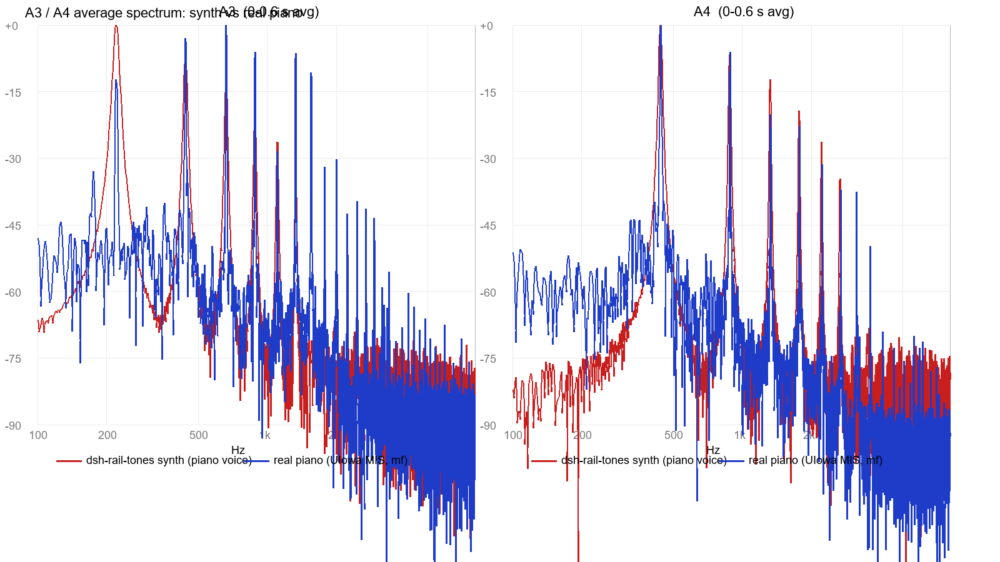

# 比对报告 1：dsh-rail-tones 钢琴合成音 vs 真实钢琴录音

- 日期：2026-10-10
- 对象：`client.js` v0.2.1 `playPiano`（离线渲染） vs 爱荷华大学 MIS 真实钢琴采样（mf 力度）
- 结论类型：分析报告，**未改动任何项目文件**

## 比对方法

1. **真实钢琴参考**：UIowa Electronic Music Studios 采样库（http://theremin.music.uiowa.edu/MISpiano.html），选取插件音域内 8 个音：A3、C#4(Db4)、E4、F#4(Gb4)、A4、C#5(Db5)、E5、F#5(Gb5)。
2. **合成音**：按 `client.js` 的 `playPiano` 全部参数逐采样复刻为 Node 离线渲染（44.1kHz/16bit）：
   - 分音权重 `PIANO_WEIGHTS = [1, 0.58, 0.38, 0.23, 0.13, 0.07]`
   - 相对衰减 `PIANO_TAUS = [1, 0.8, 0.65, 0.5, 0.4, 0.3]`
   - 失谐 `PIANO_INHARM = 0.0002`（f_n = f·n·(1+0.0002·n²)）
   - master 衰减 `PIANO_DECAY_S = 0.45`、峰值 `0.88 × 0.8`
3. **分析**：Python + numpy 统一管线——分音幅度谱（attack 0–60ms / body 100–300ms 双窗口，Hann + 抛物线插值）、失谐系数 B 拟合（f_n = n·f0·(1+B·n²) 最小二乘）、−3dB/−20dB 衰减时间、谱质心随时间变化。

## 主要发现

### 1. 衰减时长差距最大（−20dB 点，合成短 10–40 倍）

| 音 | 合成 t20dB | 真实 t20dB |
|---|---|---|
| A3 | 0.055 s | **2.64 s** |
| E4 | 0.060 s | 0.88 s |
| A4 | 0.060 s | 0.64 s |
| Gb5 | 0.060 s | 0.16 s |

原因：master 包络在 0.45s 内从峰值指数跌到 0.0001（−80dB），分音包络同步快衰，两者 dB 斜率叠加，−20dB 点实测仅 ~60ms；16-bit 量化下合成音约 0.25s 后已低于噪声底（300–450ms 窗口谱质心已测不到）。
对导航条提示音这是双刃剑：短余韵避免快速滑动时前后音糊在一起（合理取舍），但「钢琴感」明显弱于真实钢琴。

### 2. 分音结构：合成是固定斜坡，真实钢琴随音区剧变

- 合成（body 窗，所有音一致）：n2 ≈ −9dB、n3 ≈ −18dB、n4 ≈ −29dB。
- 真实钢琴：
  - 低音区（A3）：n2/n3 比基频还响 **+9.8 / +12 dB**；
  - 中音区（C#4/Gb4）：n2 与 n1 接近（−2 ~ +2dB）；
  - 高音区（C#5 以上）：n2 骤降至 −20 ~ −34dB，能量集中于基频。
- 即真实钢琴「低音厚、高音纯」，合成音所有音区一个形状。

### 3. 失谐（inharmonicity）：公式形式正确，高音区系数偏小

- 实测 B（×10⁻⁴）：A3 ≈ 1.2–2.9 → Db4 ≈ 1.6 → Gb4 ≈ 2.9 → A4 ≈ 3.5 → Db5 ≈ 5.0 → E5 ≈ 5.9 → **Gb5 ≈ 7.1**（音区越高失谐越大，与 CCRMA JOS / Wikipedia 描述一致）。
- 合成固定 `0.0002`（2×10⁻⁴）：**中音区量级吻合，高音区偏小约 3 倍**。Fletcher (1962) 指出 inharmonicity 是钢琴「温暖感」的来源，高音区缺失会更像电音。
- 实测真实采样 f0 略偏高（A4 = 441.2Hz，+5 音分）——即 Railsback 拉伸调律，合成音为纯十二平均律。

### 4. 谱质心（亮度）

- 真实钢琴各音区均稳定在 ~600–900Hz，随时间仅降 0–11%。
- 合成随音高线性上移：A3 449Hz → Gb5 1492Hz；高音区比真实亮（Gb5 1492 vs 914Hz）。

### 5. 做得好的地方

- 音高精确（拟合 f0 偏差 < 0.5%）；
- Σ 归一设计保证不削波；
- 高次分音更快衰减（τ 递减）方向正确，attack 段相对 body 段高次分音确实更亮（先亮后暗成立）；
- 中音区分音量级合理。

## 一句话结论

当前钢琴音色是**结构正确、量级偏保守的近似**：失谐公式与「高次分音先衰」的思路都对；主要差距在 (a) 余韵远短于真实钢琴、(b) 分音比例不随音区变化、(c) 高音区失谐不足。若日后改进方向：权重/τ/失谐系数改为随音级 d 缩放的曲线（低音加厚 n2/n3、高音收紧并加大 B、适当加长余韵）。

## 参考资料

- CCRMA, J.O. Smith, *Physical Audio Signal Processing*: [Piano Synthesis](https://ccrma.stanford.edu/~jos/pasp/Piano_Synthesis.html) · [Stiff Piano Strings](https://ccrma.stanford.edu/~jos/pasp/Stiff_Piano_Strings.html)
- [Wikipedia: Piano acoustics](https://en.wikipedia.org/wiki/Piano_acoustics) · [Wikipedia: Inharmonicity](https://en.wikipedia.org/wiki/Inharmonicity)
- [UIowa MIS 钢琴采样](http://theremin.music.uiowa.edu/MISpiano.html)

> 采样与中间产物（`real_mf_*.aiff`、`synth_*.wav`、`comparison.json`、`brightness.json`）在 `%TEMP%\dsh-rail-tones-compare\`。
