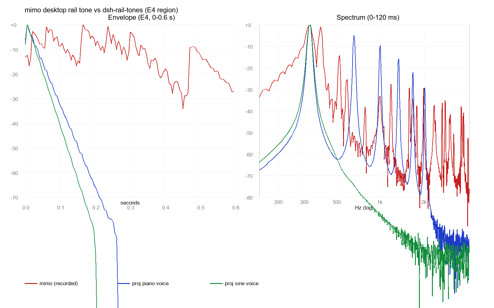

# 比对报告 2：mimo 桌面端导航条音效 vs dsh-rail-tones

- 日期：2026-10-10
- 对象：mimo 桌面端录屏音轨（`2026-10-10 20-39-24.mkv`，31s，提取 9 声提示音） vs 本项目 `piano` / `sine` 音色（离线渲染）
- 结论类型：分析报告，**未改动任何项目文件**

## 比对方法

1. ffmpeg（经 `imageio-ffmpeg`）提取录屏音轨 → 44.1kHz 单声道 WAV；
2. 包络 onset 检测（5ms RMS，+15dB 门限）定位 9 声提示音；
3. 逐声精测基频（FFT 峰值 + 抛物线插值）、匹配五声音阶、测 −20dB 时长与频谱结构；
4. 与本项目同音高（E4）的 `piano` / `sine` 离线渲染三方对比。

## 1. 音阶体系不同：mimo 是 C 大调五声，本项目是 A 大调五声

录屏 9 声实测基频：

| t(s) | f0(Hz) | 音高 | 距最近 A 大调五声音级 |
|---|---|---|---|
| 1.67 | 326.9 | E4 | −14 音分（吻合） |
| 13.36 / 13.72 / 13.95 | 164.1–164.3 | E3 | **−506 音分（不在体系内）** |
| 15.09 / 15.72 | 261.8 | C4 | **−98.7 音分 ≈ 小二度，即 C♮** |
| 17.78 / 18.73 | 391.3 | G4 | **+96.8 音分 ≈ 大二度，即 G♮** |
| 21.47 | 260.6 | C4 | −97.9 音分 |

C♮/G♮/E 组成 **C 大调五声**（C–D–E–G–A）；A 大调五声（A–B–C#–E–F#）不含 C♮、G♮。
→ 两家「音高=位置」映射不可对齐：同一位置响不同音名。mimo 起始音区更低（E3 起），本项目 A3 起。

## 2. 音色结构：mimo 是「准正弦 + 少量泛音点缀」的软钟音，不是钢琴

E4 一声三方对比：

| | mimo（录屏） | 项目 piano voice | 项目 sine voice |
|---|---|---|---|
| −20dB 时长 | **0.21 s** | 0.06 s | 0.04 s |
| 起音（−6dB 上升） | ~145 ms（软） | 6 ms 线性 | 6 ms 线性 |
| 分音结构 (n1..n6) | n1 主导；n2–n5 −30~−48dB；**n6 反而 −16.7dB（突出的固定亮泛音，非谐列衰减）** | 规则阶梯 −5/−9/−15/−21/−28dB | 纯正弦（泛音 < −69dB） |
| 谱质心 (0–80ms) | 712 Hz | 685 Hz | 333 Hz |
| 噪声底 | 有（−58dB 连续谱；8kHz 以上占 ~1%） | 无 | 无 |

听感判断：

- **mimo**：圆润绵长，慢起音 + 0.25s 余韵，基频突出、泛音稀疏且不成谐列 —— 接近「水滴/木琴」式软提示音，本质是**带一个明亮高泛音的慢衰减正弦钟音**。尾部有起伏（可能叠加低频「咚」或系统混响）。
- **项目 piano voice**：泛音多、按阶梯衰减、衰减快一个数量级，6ms 硬起音 —— 更「敲击」、更「琴」但更短促。
- **项目 sine voice**：结构上最接近 mimo（都是基频主导单频），但余韵短 5 倍（40ms vs 210ms）且缺那个 −17dB 的 n6 亮泛音。

## 3. 包络形状

- mimo：约 0.15s 内缓慢滑落（−10dB 需 ~0.1s），拖到 0.25s+，尾部有起伏；
- 项目：6ms 攻击 + 对数域直线指数衰减，piano voice 0.45s 内 −80dB 跌完。

## 4. 若日后想靠近 mimo 的听感（本次未做）

1. **余韵延长**：piano voice master 衰减的 −20dB 点从 60ms 提到 ~200ms（加大 `PIANO_DECAY_S` 或抬高 ramp 目标值）；
2. **分音结构**：减分音数量，基频为主 + 保留一个固定高次亮泛音（非谐列均匀阶梯）；
3. **起音软化**：6ms 线性改为 20–40ms 曲线上升，去敲击感；
4. **音阶体系**：mimo 用 C 大调五声自 E3/C4 起——这是产品层面选择，非技术差异。

## 5. 结论

mimo 的提示音**不是钢琴音色，而是「带一个明亮高泛音的慢衰减正弦钟音」**；音阶体系（C 大调五声）与本项目（A 大调五声）不同。本项目 sine voice 结构最接近但余韵短 5 倍、缺亮泛音；piano voice 是另一种更快衰减的思路。同一 E4 上 −20dB 时长比约为 **210ms : 60ms : 40ms**。

> 中间产物（`mimo_rail.wav`、`mimo_onsets.json`、`mimo_detail.json`、`synth_sine_E4.wav`）在 `%TEMP%\dsh-rail-tones-compare\`。
